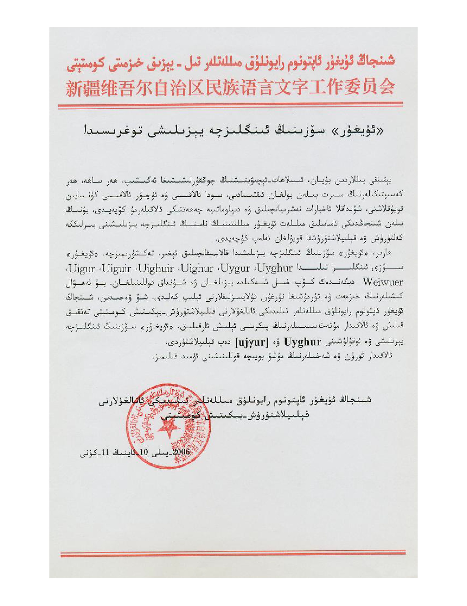

# On the English Spelling of the Word "Uyghur" (2006)

**«ئۇيغۇر» سۆزىنىڭ ئىنگلىزچە يېزىلىشى توغرىسىدا / 关于《维吾尔》一词英文转写的意见**

Notice of the Terminology Normalization Committee for Ethnic Languages of the
Xinjiang Uyghur Autonomous Region, October 11, 2006, standardizing the English
spelling **Uyghur** and the pronunciation **[ujɣur]**. The notice is officially
trilingual — Uyghur, English, and Chinese — and all three versions are
transcribed here.

| | |
|---|---|
| Issuing body | Terminology Normalization Committee for Ethnic Languages of the XUAR (شىنجاڭ ئۇيغۇر ئاپتونوم رايونلۇق مىللەتلەر تىلىدىكى ئاتالغۇلارنى قېلىپلاشتۇرۇش-بېكىتىش كومىتېتى / 新疆维吾尔自治区民族语言名词术语规范审定委员会) |
| Letterhead | Language and Script Work Committee of the XUAR (مىللەتلەر تىل-يېزىق خىزمىتى كومىتېتى / 民族语言文字工作委员会) |
| Date | October 11, 2006 |
| Transcriptions | [Uyghur](Uyghur_Name_UG.md) · [English](Uyghur_Name_EN.md) · [Chinese](Uyghur_Name_ZH.md) — verbatim |
| Source scan | [Uyghur-Uygur-Uighur-Uigur.pdf](Uyghur-Uygur-Uighur-Uigur.pdf) |
| Page images | [Uyghur_Name_Page_1.png](Uyghur_Name_Page_1.png) · [Uyghur_Name_Page_2.png](Uyghur_Name_Page_2.png) · [Uyghur_Name_Page_3.png](Uyghur_Name_Page_3.png) |

## Provenance

Source PDF SHA-256:
`213526A77740443D1C6F534350254D75B4951FFF9806736BDA4B1EB24DBB9D93`

The page images in this folder are renderings of the same scan for inline
viewing. Page 1 carries the Uyghur version, page 2 the English, page 3 the
Chinese.

## About this document

This notice is the official basis for the English spelling *Uyghur*. Surveying
usage, the committee found seven spellings in circulation — Uyghur, Uygur,
Uighur, Uighuir, Uiguir, Uigur, and Weiwuer — and, after research and expert
consultation, fixed the English transcription as **Uyghur** with the
pronunciation **[ujɣur]**, inviting government organizations and individuals to
conform.

The notice was issued by the Terminology Normalization Committee on the
letterhead of the XUAR Language and Script Work Committee, and is one of the few
official documents issued trilingually in Uyghur, English, and Chinese. It is
the document to cite on why *Uyghur* — rather than the older *Uighur* still used
by some English-language media — is the standard spelling.

## Transcription policy

The transcriptions reproduce the printed text of each language version exactly.
No modernization, normalization, or correction has been applied. The
transcription was verified against the scan sentence by sentence. The scan in
this folder is the authority; any discrepancy between transcription and scan is
a transcription error, and corrections to match the scan are welcome.
